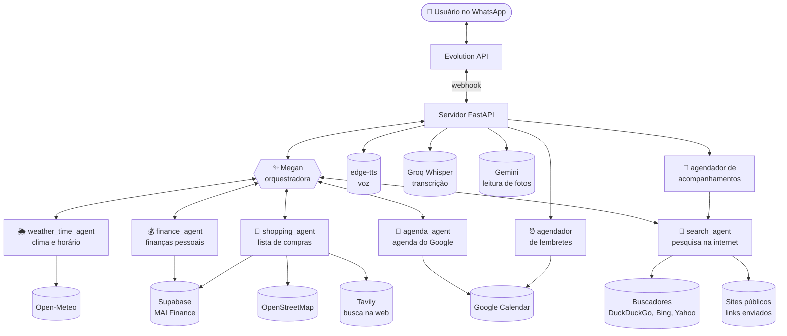

# ✨ Megan: assistente pessoal no WhatsApp

Conheça o projeto completo em **[brunovdl.github.io/megan.site](https://brunovdl.github.io/megan.site/)**.

## 🧠 Arquitetura

```mermaid
flowchart TD
    U([📱 Usuário no WhatsApp]) <--> E[Evolution API]
    E <-->|webhook| S[Servidor FastAPI]
    S <--> M{{✨ Megan<br/>orquestradora}}
    S --> V[(edge-tts<br/>voz)]
    S --> WH[(Groq Whisper<br/>transcrição)]
    S --> IMG[(Gemini<br/>leitura de fotos)]
    S --> L[⏰ agendador<br/>de lembretes]
    S --> AC[🔄 agendador de<br/>acompanhamentos]
    M <--> W[🌦️ weather_time_agent<br/>clima e horário]
    M <--> F[💰 finance_agent<br/>finanças pessoais]
    M <--> C[🛒 shopping_agent<br/>lista de compras]
    M <--> A[📅 agenda_agent<br/>agenda do Google]
    M <--> P[🔎 search_agent<br/>pesquisa na internet]
    W --> OM[(Open-Meteo)]
    F --> DB[(Supabase<br/>MAI Finance)]
    C --> DB
    C --> OSM[(OpenStreetMap)]
    C --> TV[(Tavily<br/>busca na web)]
    A --> GC[(Google Calendar)]
    L --> GC
    P --> DDG[(Buscadores<br/>DuckDuckGo, Bing, Yahoo)]
    P --> WEB[(Sites públicos<br/>links enviados)]
    AC --> P
```

